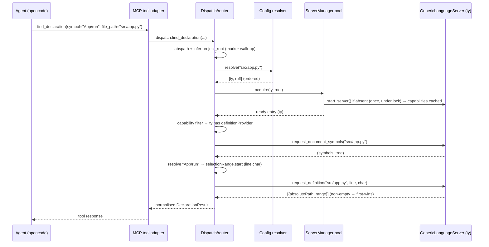
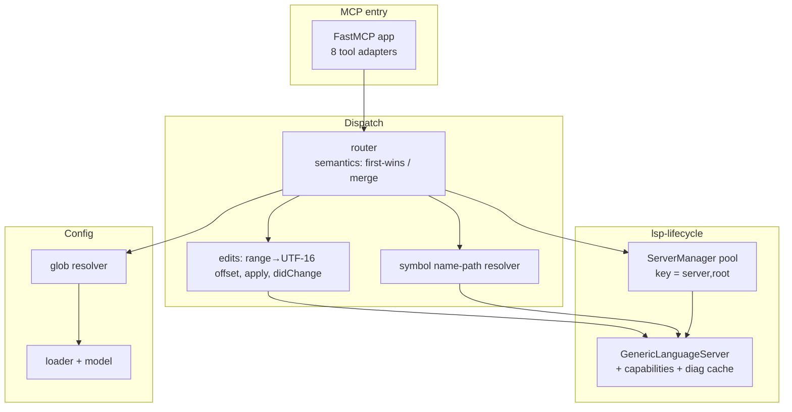

# Design — `lsp-mcp`

Architecture for a stateless Python MCP server that wraps LSP clients and exposes eight
code-navigation/editing tools to LLM agents, driven by a **single global**
extension→server policy at `~/.config/lsp-mcp/config.yml`.

Scope and rationale are in `proposal.md`; this document is the implementation companion.
It is written to be implemented directly — layer responsibilities, key data shapes, control
flow, and the non-obvious LSP/multilspy traps are pinned down; full method bodies are not
(they belong in code).

## Confirmed givens (design inputs, not decisions)

These are fixed by the brief and the agreed config; the design builds within them.

- LSP client foundation is **multilspy v0.1.0** (PyPI, Microsoft Research); we do **not** fork it.
- Use **`AsyncLanguageServer`**, not `SyncLanguageServer` (avoids known deadlock issue #124).
- Config file location and shape are agreed (`servers` + `file_handlers`, see §7).
- Server must be **stateless per project**: no `.lsp-mcp/` project files, no restart per project.
- Exactly the eight tools listed in the brief; no completions/hover (issue #127 is moot).
- Distribution: `uvx lsp-mcp` / `uv run --project …`; local **stdio** MCP server in `opencode.jsonc`.

### multilspy public surface confirmed from upstream docs

- `LanguageServer.create(config, logger, repository_root)` → instance; `async with lsp.start_server():` runs the process for the block.
- `await lsp.request_definition(path, line, char)` → `[{uri, absolutePath, relativePath, range:{start,end}}]`.
- `await lsp.request_references(path, line, char)` → list of the same location shape.
- `await lsp.request_document_symbols(path)` → `(symbols, tree)`; each symbol `{name, kind, range, selectionRange, detail}`.
- `await lsp.request_hover(...)`, `request_completions(...)` (unused here).
- Low-level protocol handler under `multilspy/lsp_protocol_handler/` exposes `send_request(method, params)` for LSP methods multilspy does not wrap.
- `MultilspyConfig` supports `code_language`, `trace_lsp_communication`, `start_independent_lsp_process`, `server_binary`, `server_install_dir`.

### Verify-before-implement (engineer confirms against installed sources — not design blockers)

1. Exact override point in a `LanguageServer` subclass to launch an **arbitrary command** (the per-language subclasses build a `ProcessLaunchInfo`/command internally). Design assumes we subclass and supply the command; confirm the hook name.
2. Whether multilspy surfaces `InitializeResult.capabilities` publicly. Design does **not** rely on it — our subclass captures capabilities itself (§5).
3. Whether multilspy already stores pushed `publishDiagnostics`. Design captures them itself (§5/tool 8) and uses upstream storage only if present.
4. `mcp` Python SDK: exact `FastMCP` decorator/registration API and stdio-run call for the installed version (§8).

---

## 1. Module / package structure

Five logical layers, top depends only on those below it. Suggested package `lsp_mcp/`
(filenames illustrative, not prescriptive):

```
lsp_mcp/
  __main__.py        # console entry-point; builds app, runs stdio MCP loop
  server.py          # MCP app: registers the 8 tools as thin async adapters
  tools/             # one adapter per tool -> validates args, calls dispatch, shapes response
  dispatch/          # routing + semantics (first-wins / merge), symbol resolution, edits
  lsp/               # GenericLanguageServer, ServerManager pool, capabilities, diagnostics
  config/            # load + validate config.yml, model, glob resolver
  types.py           # shared response/data models (Location, SymbolNode, Diagnostic…)
```

Layer responsibilities and mapping to the proposal capabilities:

| Layer | Responsibility | Proposal capability |
|---|---|---|
| **entry/MCP** (`__main__`, `server`, `tools`) | expose 8 tools, arg validation, response shaping, stdio transport | `mcp-tools` |
| **dispatch** | route a call to server(s), apply first-wins/merge, resolve symbol names→positions, apply edits | `mcp-tools` |
| **lsp** | launch/track/shutdown server processes, capability capture, diagnostics collection | `lsp-lifecycle` |
| **config** | read/validate `config.yml`, glob-match a path → ordered server list | `config` |

Rule: the **dispatch** layer holds all tool *semantics*; **tools** adapters stay thin (parse
args in, format result out) so the semantics are unit-testable without the MCP transport.

---

## 2. LSP server manager (`lsp/manager.py`)

A `ServerManager` owns a **persistent pool** of running language servers, one process per
`(server_name, project_root)` pair, started on demand and kept alive across tool calls.

### Why persistent (options considered)

- **Start/stop per tool call** — trivial lifecycle, no leaks, but every call re-runs the
  server's `initialize` + workspace indexing (seconds for gopls/rust-analyzer). **Rejected**:
  latency is unacceptable and it defeats document-sync/incremental features.
- **Persistent pool, keyed by (server, root), with idle eviction** — fast subsequent calls,
  correct sync; cost is manual lifetime management of multilspy's context manager plus bounded
  resource use. **Chosen.**

### Pool entry and key

```python
PoolKey = tuple[str, str]            # (server_name, abs_project_root)

@dataclass
class ServerEntry:
    server: GenericLanguageServer
    exit_stack: AsyncExitStack       # holds the open start_server() context
    lock: asyncio.Lock               # serialises start / restart for this key
    last_used: float
    state: Literal["starting", "ready", "failed"]
```

### Keeping multilspy's context manager open

`start_server()` is an async context manager that shuts the process down on block exit. To keep
it alive we enter it into an `AsyncExitStack` we own and close it later:

```python
await entry.exit_stack.enter_async_context(server.start_server())   # start, keep open
...
await entry.exit_stack.aclose()                                     # graceful shutdown
```

### Lifecycle rules

- **On demand:** `await manager.acquire(server_name, root)` returns a `ready` entry, starting it
  under the per-key `lock` if absent (so concurrent calls don't double-start the same server).
- **Reuse:** subsequent calls for the same key reuse the running process; `last_used` bumped.
- **Idle eviction:** background sweep closes entries idle beyond a TTL (e.g. 15 min) and enforces
  a max concurrent-server cap (LRU eviction) to bound memory.
- **Crash handling:** a request raising a transport/closed error marks the entry `failed`, evicts
  it, and retries **once** with a fresh start; a second failure surfaces as a degraded result.
- **Graceful shutdown:** on MCP server stop, `aclose()` every entry so no LSP child is orphaned.

`project_root` resolution (server is stateless): from the tool's `file_path`, walk parent dirs
for a project marker (`.git`, `pyproject.toml`, `go.mod`, `package.json`, `tsconfig.json`); fall
back to the file's directory. An optional explicit `project_root` tool arg may override
(cheap to add; the given tool signatures omit it, so inference is the default path).

---

## 3. multilspy extension strategy (`lsp/generic_server.py`)

Goal: run servers multilspy doesn't know (`ty`, `ruff`) and future ones, **without forking**, and
route the built-ins (`gopls`, `typescript-language-server`) through the same path for uniformity.

### Options

- **Fork / patch the `Language` enum** — brittle, defeats "no fork". **Rejected.**
- **Use `.create()` for built-ins, custom path for ty/ruff** — two code paths, and the built-in
  path hides server selection inside multilspy instead of our config. **Rejected** (violates
  "config is the single source of truth for server selection").
- **One `GenericLanguageServer(LanguageServer)` subclass for *every* server, launched from the
  config `command`.** **Chosen** — uniform, config-driven, reuses all of multilspy's JSON-RPC,
  document sync, and `request_*` methods unchanged.

### `GenericLanguageServer` responsibilities

Subclass multilspy's async `LanguageServer`, instantiated **directly** (bypassing the
`code_language`-keyed `.create()` factory), providing:

1. **Launch command** — the `command: [...]` list from config (e.g. `[uvx, ty, server]`), fed to
   multilspy's process-launch mechanism (confirm the exact hook, verify-point 1).
2. **Generic `initialize` params** — standard `InitializeParams` with `rootUri`/`workspaceFolders`
   = project root and a full client `capabilities` block; no server-specific tuning required for
   ty/ruff/gopls/tsserver. (Config may later carry optional `initialization_options` per server —
   schema leaves room, **not built now**, see YAGNI.)
3. **Capability capture** — record `InitializeResult.capabilities` into `self.capabilities` during
   the handshake (§5), independent of whether multilspy exposes it.
4. **`raw_request(method, params)`** — thin wrapper over the protocol handler's `send_request` for
   LSP methods multilspy does not wrap (`workspace/symbol`, `textDocument/implementation`,
   `textDocument/rename`, pull `textDocument/diagnostic`).
5. **Diagnostics notification handler** — register for `textDocument/publishDiagnostics` and store
   latest per-URI (§5, tool 8).

The subclass adds behaviour; it overrides nothing in multilspy's request/response or sync paths.

---

## 4. Tool dispatch layer (`dispatch/router.py`)

Central routing given a `file_path` and the tool being invoked.

### Routing steps

1. **Resolve** `file_path` to absolute; infer `project_root` (§2).
2. **Config match** (§7): glob-match the path → **ordered** list of configured server names.
3. **Acquire** each server via `ServerManager` (§2), skipping any that fail to start (partial
   tolerance).
4. **Capability filter** (§5): keep only servers advertising the capability the tool needs.
5. **Apply per-tool semantics** (below).
6. **Normalise** the LSP result into the tool's response model (`types.py`).

### Per-tool semantics

| Tool | LSP method(s) | Capability gate | Multi-server rule |
|---|---|---|---|
| `get_symbols_overview` | `documentSymbol` | `documentSymbolProvider` | first-wins |
| `find_symbol` | `workspace/symbol` (raw) | `workspaceSymbolProvider` | first-wins |
| `find_declaration` | `definition` | `definitionProvider` | first-wins |
| `find_implementations` | `implementation` (raw) | `implementationProvider` | first-wins |
| `find_referencing_symbols` | `references` | `referencesProvider` | first-wins |
| `rename_symbol` | `rename` (raw) → WorkspaceEdit | `renameProvider` | **first capable** handles it |
| `replace_symbol_body` | `documentSymbol` to locate range | `documentSymbolProvider` | first-wins for range; edit is ours |
| `get_diagnostics_for_file` | push `publishDiagnostics` / pull `diagnostic` | see §5 | **merge all** |

- **First-wins** = query capable servers in config order; return the first **non-empty** result
  (empty is not a win — fall through to the next server, e.g. `ty` empty → try next).
- **Merge** = concatenate results from all capable servers (diagnostics), tagged with source
  server name; de-duplicate identical entries.
- **No capable server** = return an empty result plus a clear `note` (e.g. "no configured server
  for `*.py` advertises `renameProvider`"); never raise into the agent.
- **Partial failure** = if some servers failed to start, proceed with the rest and include a
  `warnings` field; a fully-failed acquire returns an explanatory empty result.

---

## 5. Capability discovery (`lsp/capabilities.py`)

Do not make users declare navigation-vs-diagnostics roles — discover them.

- During `GenericLanguageServer` initialize, capture `InitializeResult.capabilities` into
  `self.capabilities` (a plain dict), cached for the server's lifetime (capabilities do not change
  post-initialize).
- A `CapabilitySet` wraps that dict and answers routing predicates the dispatch layer calls:

```python
class CapabilitySet:
    def supports(self, tool: ToolKind) -> bool: ...
    # documentSymbolProvider, workspaceSymbolProvider, definitionProvider,
    # referencesProvider, implementationProvider, renameProvider (bool | {prepareProvider}),
    # diagnosticProvider (pull, LSP 3.17+)
```

**Diagnostics is the special case.** LSP has two models:

- **Push** (`textDocument/publishDiagnostics` notification) — no capability flag; server pushes
  after `didOpen`/`didChange`. `ruff`/`ty` typically push.
- **Pull** (`textDocument/diagnostic` request) — advertised via `diagnosticProvider` (LSP 3.17+).

`get_diagnostics_for_file` therefore: if `diagnosticProvider` is advertised, issue a pull request;
otherwise ensure the document is open (`didOpen`), wait a **bounded** interval for pushed
diagnostics to settle, and read the per-URI push cache maintained by the notification handler
(§3.5). Results from all configured servers are merged.

---

## 6. Symbol-range resolution for `replace_symbol_body` (`dispatch/symbols.py`, `dispatch/edits.py`)

Tools take a **symbol name**, but LSP requests need a **position**. Resolution bridges the two.

### Name → node

Support Serena-style **name paths** (`MyClass/my_method`) matched against the document-symbol
tree from `request_document_symbols(file_path)`:

- Retrieve `(symbols, tree)`; walk the hierarchical tree matching path segments by `name`.
- A bare name matches any node with that name (error/ask if ambiguous across multiple matches —
  return the candidates rather than guessing).
- Each node carries `range` (whole symbol incl. body) and `selectionRange` (the identifier).

### Positions used

- **Position-based nav tools** (`find_declaration`, `find_implementations`,
  `find_referencing_symbols`, `rename_symbol`): use `selectionRange.start` (the identifier) as the
  request position.
- **`replace_symbol_body`**: use the full `range` as the text-edit span.

### Applying the edit (the LSP offset trap)

`replace_symbol_body` and `rename_symbol` mutate files on disk. Both convert LSP ranges to string
offsets, splice, write, then keep the server in sync.

> **Critical:** LSP `character` offsets are **UTF-16 code units**, not bytes and not Unicode
> code points. Converting `{line, character}` to a Python string index must account for this on
> lines containing non-BMP characters (emoji, some CJK). Centralise conversion in one
> `position_to_index(text, line, character)` helper and test it against multi-byte lines.

- **`replace_symbol_body`**: read file → convert `range` to `[start, end)` indices → replace with
  `new_body` → write → send `textDocument/didChange` (or close/reopen) so the server's view stays
  consistent for subsequent calls. We compute and apply the edit ourselves — no
  `workspace/applyEdit` (that is a server→client flow).
- **`rename_symbol`**: `textDocument/rename` returns a `WorkspaceEdit` spanning possibly **many
  files**; apply each file's edits **bottom-up** (highest offset first) so earlier edits don't
  invalidate later offsets, then `didChange` each touched file. Return the list of changed files.

---

## 7. Config loading and validation (`config/`)

- **Location:** `~/.config/lsp-mcp/config.yml` (respect `$XDG_CONFIG_HOME` if set). Loaded **once**
  at startup; a missing/invalid file is a **fatal startup error** with an actionable message (the
  server has nothing to route without it).
- **Parse → model** (`config/model.py`), validated on load:

```python
@dataclass(frozen=True)
class ServerSpec:
    name: str
    command: list[str]                       # e.g. ["uvx", "ty", "server"] — non-empty
    initialization_options: dict | None = None   # reserved; not consumed in v1

@dataclass(frozen=True)
class FileHandler:
    pattern: str                             # glob, e.g. "*.py"
    servers: list[ServerSpec]                # ordered; priority = list order

@dataclass(frozen=True)
class Config:
    servers: dict[str, ServerSpec]
    handlers: list[FileHandler]              # preserves file order for tie-breaking
```

- **Validation:** every `file_handlers` entry references a defined `servers` key (else fatal);
  `command` non-empty; patterns compilable. Resolve `command[0]` on `PATH` lazily at spawn time —
  a missing binary degrades that one server (§2 crash handling), it is not a startup failure.
- **Glob matching** (`config/resolver.py`): match against the **basename** for `*.ext` patterns
  (and full relative path for path-style globs) using `fnmatch`/`pathlib`. On multiple matching
  handlers, concatenate their server lists in file order, de-duplicating by server name (first
  occurrence wins ordering). Returns the ordered `list[ServerSpec]` the dispatch layer consumes.
- **No hot reload** in v1 (YAGNI): config is read at startup; changing it means restarting the
  MCP server.

---

## 8. MCP server entry point (`server.py`, `__main__.py`)

- Build the app with the **`mcp` Python SDK**, using **`FastMCP`** decorator-based registration so
  each tool's type-hinted signature generates its input schema. (Confirm exact API for the
  installed SDK version — verify-point 4.)
- Each of the 8 tools is a thin `async` adapter that validates inputs and calls the dispatch
  layer; no LSP logic lives here.
- **Transport: stdio only** — this is a local server launched by opencode. No SSE/HTTP (YAGNI).
- **Console script** `lsp-mcp` (in `pyproject.toml` `[project.scripts]`) so `uvx lsp-mcp` and
  `uv run` both work; `__main__` loads config, constructs `ServerManager`, registers tools, and
  runs the stdio loop; on exit it `aclose()`es the manager (§2 graceful shutdown).
- Startup order: load+validate config → construct `ServerManager` (no servers started yet) →
  register tools → serve. Servers start lazily on first relevant tool call.

```python
# shape only
mcp = FastMCP("lsp-mcp")

@mcp.tool()
async def find_declaration(symbol: str, file_path: str) -> DeclarationResult:
    return await dispatch.find_declaration(symbol, file_path)
# … 7 more adapters …
```

---

## Data flow — a typical tool call (`find_declaration`)



If `ty` returned empty, dispatch would try `ruff` next (empty ≠ win); if no configured server
advertised `definitionProvider`, it returns an empty result with an explanatory note.

## Component / control-flow overview



---

## Cross-cutting decisions & YAGNI rejections

Everything below was challenged against **resilience, maintainability, clarity/simplicity, and
YAGNI**; each rejected item has a recorded reason.

- **AsyncLanguageServer over Sync** — avoids deadlock #124 and matches the async MCP SDK.
- **Uniform `GenericLanguageServer` for all servers** — one config-driven path; server selection
  lives in *our* config, not multilspy's enum.
- **Persistent pool over per-call start** — latency; correctness of sync/indexing.
- **We apply edits ourselves** (read/splice/write + `didChange`) rather than relying on
  `workspace/applyEdit` — that is a server-initiated flow, not what we need.

Rejected as speculative (not built in v1):

- Per-project config / `.lsp-mcp/` files — the whole point is a single global policy.
- Config hot-reload / file watching — restart on change; add only if a real need appears.
- Per-server `initialization_options` consumption — schema field reserved, not wired.
- Hover, completion, call-hierarchy, or any tool beyond the eight — out of scope (issue #127 moot).
- Non-stdio transports (SSE/HTTP) — local server only.
- A result/symbol cache beyond the per-server capability + diagnostics caches — start simple;
  measure before adding.
- Building our own JSON-RPC / process management — reuse multilspy's.

---

## Resilience & failure-mode profile

| Failure | Detection | Response | Blast radius |
|---|---|---|---|
| Server binary missing / start fails | spawn error on `acquire` | mark that `(server,root)` unavailable; continue with remaining servers; result carries a warning | one server for one project |
| Server crash mid-session | transport/closed error on request | evict entry, restart **once**; if that fails, degrade to partial result | one `(server,root)` |
| Deadlock (#124) | n/a | avoided by AsyncLanguageServer | — |
| Slow first index (gopls/rust-analyzer) | per-request timeout | first call slow; subsequent fast via pool; timeout returns partial/empty + note rather than hang | one call |
| Diagnostics not yet pushed | bounded settle wait elapses | return diagnostics collected so far | one call |
| UTF-16 offset miscomputation | unit tests on multi-byte lines | single conversion helper; guarded range validation before write | one edit |
| Concurrent double-start of same server | per-key `asyncio.Lock` | second caller awaits the first start | — |
| Idle resource growth | idle TTL + max-server cap | LRU eviction / idle close | bounded process count |
| MCP shutdown | context/loop teardown | `aclose()` all entries → no orphaned LSP children | — |

**Scaling:** cost is bounded by the number of `(server × active project)` combinations, each a
subprocess with its own index/memory; cap concurrency and evict idle. **Migration:** greenfield —
none.

---

## Component breakdown (work-kind + done-criterion)

Implementation is handed off as a breakdown; no implementing agent is assigned (the `engineer`
implements all of it, loading the matching skill per work-kind). This is not a task list.

1. **Config layer** — *application code (Python)*. Done: loads and validates the agreed sample
   `config.yml`; a path glob-resolves to the correct ordered server list; invalid config fails
   startup with an actionable message; unit-tested including multi-handler merge.
2. **GenericLanguageServer** — *application code*. Done: launches an arbitrary configured command,
   completes the `initialize` handshake, captures capabilities, and serves `request_document_symbols`/
   `request_definition`/`request_references` plus `raw_request` for unwrapped methods, verified
   against `ty`, `ruff`, and `gopls`.
3. **ServerManager pool** — *application code*. Done: reuses one process per `(server,root)`;
   concurrency-safe start under per-key lock; idle-evicts and caps; restarts once on crash;
   `aclose()` leaves no orphaned processes.
4. **Capability discovery** — *application code*. Done: `CapabilitySet.supports(tool)` returns the
   correct predicate per tool from a captured `InitializeResult`, including the push-vs-pull
   diagnostics distinction.
5. **Diagnostics collection** — *application code*. Done: a `*.py` file returns diagnostics merged
   from both `ty` and `ruff`, tagged by source, via push cache or pull request as advertised.
6. **Dispatch/router** — *application code*. Done: first-wins for nav (empty ≠ win), merge for
   diagnostics, capability-filtered, partial-failure tolerant, no-capable-server returns an
   explained empty result.
7. **Symbol resolution + edits** — *application code*. Done: name-path resolves to the right node;
   `replace_symbol_body` and `rename_symbol` apply correct on-disk edits with UTF-16-correct
   offsets (multi-byte-line tested) and keep servers in sync; multi-file rename applied bottom-up.
8. **MCP entry point + packaging** — *application code + packaging*. Done: `uvx lsp-mcp` starts a
   stdio MCP server exposing all eight tools with correct input schemas, discoverable by opencode;
   clean startup (lazy server start) and shutdown.
